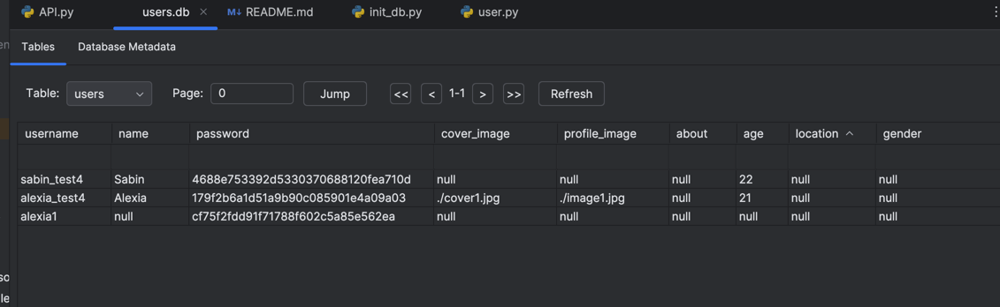

# TSN - API

## Setup

In the `API` directory, you should run this:

```bash
python3 -m venv venv
cd venv
source source ./bin/activate
pip install --upgrade pip
pip install -r ../requirements.txt
cd ..
mkdir storage
```

The `storage` folder is where the database files will be stored: eg: for images: API/storage/images.db

After this, if you open the folder `API` inside vscode, you should be prompted to use this environment or something like 'local stuff detectect'.

To create and fill the database with stuff, use:
```bash
python3 init.db
```

API v2: poti face update doar la descriere, gender, location, age

API v3: (14 mai 2024)
- corectat ce nu era bine inainte;
- merg functiile de update (pentru 'name', 'cover_image', 'profile_image', 'about', 'age', 'location', 'gender', 'password')
- merg functiile de get (pentru 'name', 'cover_image', 'profile_image', 'about', 'age', 'location', 'gender')
- password-ul apare hash-uit in db
- pozele ('profile_image', 'cover_image') sunt salvate ca string-uri sub forma de path-uri (de ex "./cover.img"")
- poate fi ignorata images.db


        

To run the backend:
```bash
python3 API.py
```

## Resources

- [Flask SQLite](https://flask.palletsprojects.com/en/2.3.x/patterns/sqlite3/)